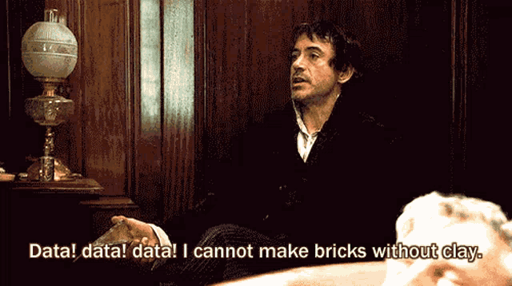

<h1 align="center">
  Hey Geeks! 
  
</h1>

<!-- Your local image under Hey Geeks -->

  

<!-- Sherlock Holmes Quote -->

  <em>"Data! Data! Data! I can't make bricks without clay."</em> 
  – Sherlock Holmes, <em>The Adventure of the Copper Beeches</em>

  🌟 I believe <strong>data is the foundation for building insights and solutions</strong>.

---

## 🌸 About Me  

🎓 I'm **R-Muminah**, a passionate student of **Data Science & AI**.  
📊 I enjoy **analyzing data, building AI models, and exploring new algorithms**.  
🌱 Currently learning **Python, Machine Learning & Deep Learning tools**.  
💡 Dream: **Contribute to impactful AI projects and research.**  

---

## 🛠️ Tech Stack  

   
  
  
  
  
  

---

## 🌱 Currently Learning  
- Statistics, Python & Data Visualization  
- Machine Learning & Deep Learning basics  
- Pandas, Numpy, Scikit-Learn, TensorFlow, Jupyter  

---

## 👩‍💻 I’m Working On  
- Data Cleaning, Analysis & Visualization projects  
- Step-by-step AI model building  
- Problem-solving on Kaggle & LeetCode  

---

## 🤝 I’m Looking To Collaborate On  
- Beginner-friendly **Data Science & AI projects**  
- Open-source contributions in Python  

---

## 💬 Ask Me About  
- AI & Data Science journey  
- Study techniques & learning roadmap  

---

## ⚡ Fun Fact  
🌸 I believe **"Data tells stories; we just need to listen."**  

---

<!-- Snake Animation under everything, before footer -->

  

<!-- Footer -->

  

